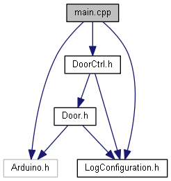
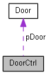

# Arduino FSM

This Repo provides an Example how to write a Finite-state machine (FSM) which can be nested in C++.  
It's based on this Wiki-Article: [Finite-state_machine](https://en.wikipedia.org/wiki/Finite-state_machine) and an example by R.Bonderer (HSR) from *Embedded Software Engineering*.

<p align="center"></p>

## Table of Content
<!-- TOC Generated with https://magnetikonline.github.io/markdown-toc-generate/ -->

[TOC]

<div style="page-break-after: always;"></div>

# Documentation
## Software
View the GitHub-Page for the [source-code documentation](https://lmazzole.github.io/ArdFSM/)

### Dependency Graph

<p align="center">
    <a href=https://lmazzole.github.io/ArdFSM/main_8cpp.html>
        
    </a>
    <p align="center"><small>Click on image to open doxygen-documentation.</p>
</p>


### Collaboration Diagram

<p align="center">
    <a href=https://lmazzole.github.io/ArdFSM/class_door_ctrl.html>
        
    </a>
    <p align="center"><small>Click on image to open doxygen-documentation.</p>
</p>


# Documentation with Doxygen
## What is Doxygen?
Doxygen is a [Open-Source](https://github.com/doxygen/doxygen) documentation generator. It extracts source code documentation directly from the annotated code. Doxygen supports a lot of popular programming languages such as C++, C , Java, Python, etc.

For Doxygen to detect the documentation, special comments are needed. One example is shown below, but there are many more possible variants as shown in the [Doxygen Documentation](http://www.doxygen.nl/manual/docblocks.html).
```
/**
 * @brief A short one line description
 *
 * <Longer description>
 * <May span multiple lines or paragraphs as needed>
 *
 * @param  Description of method's or function's input parameter
 * @param  ...
 * @return Description of the return value
 */
```
[Source: [Wikipedia: Doxygen](https://en.wikipedia.org/wiki/Doxygen)]  
The main benefit of doxygen is, that the documentation can be written directly in the source code itself and is therefore easy to keep up to date. It can also automatically generate the visualization from relations between classes, objects, inheritance and other dependencies.

Doxygen can generate HTML, LaTeX, Man pages, RTF and XML  Output-Files.

If you need more information about Doxygen-Comments check out: [How to Write Doxygen Doc Comments](https://github.com/stan-dev/stan/wiki/How-to-Write-Doxygen-Doc-Comments).

### HowTo install Doxygen for Windows
Detailed instructions on how to install Doxygen can be found in the [Doxygen Installation manual](http://www.doxygen.nl/manual/install.html). 
1. Download a binary distribution at [Doxygen Download](http://www.doxygen.nl/download.html). It's called something like "doxygen-**X.X.XX**-setup.exe"  
2. Select "Full Installation" (default option) 
3. Go to the **Control Panel →  System and Security → System**, and on the navigation panel on the right side, you will see the link Advanced systems settings.
4. Once in advanced systems settings, a dialogue box will open and show the button Environment Variables. Click on the button Environment Variables.
5. Add "c:/doxygen/bin" (or whatever path was used during the installation) to the System PATH variable to run "doxygen" without providing the full path to the binary.  

[Source: [PALISADE](https://git.njit.edu/palisade/PALISADE/wikis/how-to-setup-doxygen-windows) ]

<div style="page-break-after: always;"></div>

### HowTo install .dot and graphix
If you like to draw class diagrams, collaboration diagrams, overall class hierarchy and dependency graphs you need to install the GraphViz package.
You can download a stable Windows release on the [Graphviz Website](<https://graphviz.gitlab.io/_pages/Download/Download_windows.html>).

1. Download the installer for Windows (graphviz-**X.XX**.msi)
2. The default installation path will be C:\Program Files (x86)\GraphvizX.XX\bin (Example: Graphviz**X.XX** → Graphviz2.38)
3. Open cmd window as administrator and go the location C:\Program Files (x86)\GraphvizX.XX\bin and run the below command:
 >dot.exe

4. Exit the command window.
5. Go to the **Control Panel →  System and Security → System**, and on the navigation panel on the right side, you will see the link Advanced systems settings.
6. Once in advanced systems settings, a dialogue box will open and show the button Environment Variables. Click on the button Environment Variables.
7. Select the entry "Path" on the system variables section and add C:\Program Files (x86)\Graphviz **X.XX** \bin to the existing path.

[Source: [Atlassin-How to install Graphviz(Windows,Mac,Linux)](<https://bobswift.atlassian.net/wiki/spaces/GVIZ/pages/20971549/How+to+install+Graphviz+software>), [Generating a callgraph in Doxygen](<https://romanegloo.wordpress.com/2012/03/29/generating-a-callgraph-by-using-doxygen-and-graphviz-13/>)]

### HowTo run Doxygen

1. Start doxywizard (Desktop App) 
2. Click on File->Open and choose Doxyfile in the folder doxygen 
3. In doxywizard switch to the Tab Run and click on Run doxygen
4. When Doxygen has finished, click on Show HTML output.  

If you like to generate diagrams make sure, that in the Tab Wizard/Diagrams the button "Use dot tool from GraphViz package" is activated.

You can use doxygen also only in console. Check the [Doxygen-Documentation](http://www.doxygen.nl/manual/index.html) if you need to know more.

### Doxygen and GitHub-Pages
1. Generate your doxyfile direct into ./docs.  

2. You need to add an .nojekll file in ./docs.  
This is necessary because Jekyll considers directories that start with underscores to be special resources and does not copy them to the final site. [Source: [Bypassing Jekyll on GitHub Pages](https://github.blog/2009-12-29-bypassing-jekyll-on-github-pages/)]

3. Under Settings -> GitHub Pages -> Source choose master branche ./docs folder.

4. Save

   <div style="page-break-after: always;"></div>

### Doxygen and  VSCode

There's a useful extension for VSCode, called: [Doxygen Documentation Generator](https://marketplace.visualstudio.com/items?itemName=cschlosser.doxdocgen).

You can personalize the apperance of the comments in the config-options: Manage/Settings/User/Extensions/Doxygen Documentation Generator Settings -> Edit in settings.json  
It looks something like this:

>   "doxdocgen.generic.returnTemplate": "@return {type} - ",  
> ​   "doxdocgen.generic.paramTemplate": "@param {param} - ",  
> ​   "doxdocgen.file.versionTag": "@version 1.0 - Description - {author} - {date}",  
> ​   "doxdocgen.file.fileOrder": [  
> ​       "file",  
> ​       "brief",  
> ​       "empty",  
> ​       "author",  
> ​       "empty",  
> ​       "version",  
> ​       "empty",  
> ​       "date",  
> ​       "copyright",  
> ​       "empty",  
> ​       "custom"  
> ​    ],  

# Contributors

- [Luca Mazzoleni](https://github.com/LMazzole)

# Changelog

V 1.0	-	Release BA FS19	-	[Luca Mazzoleni](https://github.com/LMazzole)

# License

MIT License


